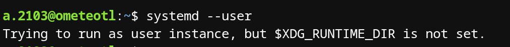
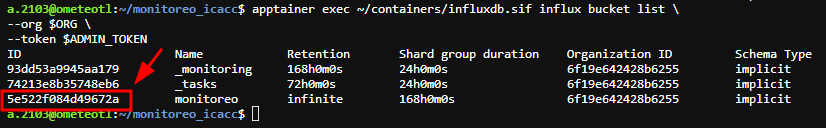
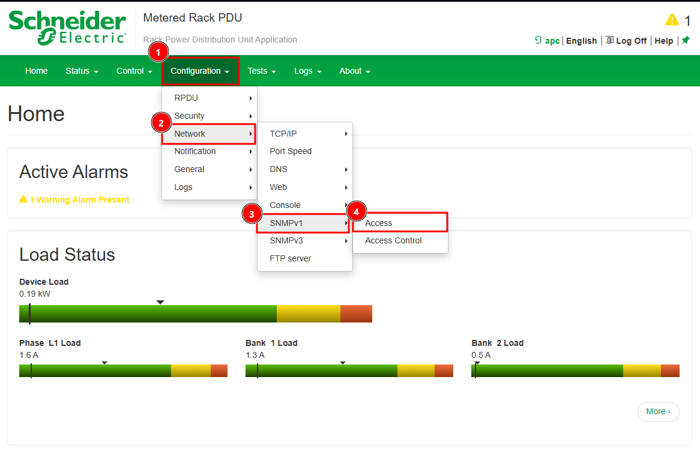

# Monitoreo de cluster HPC con InfluxDB, Grafana y Telegraf  
  
# Resumen  
  
Este proyecto implementa un sistema de monitoreo para un cluster HPC utilizando **InfluxDB**, **Grafana** y **Telegraf**, desplegados mediante contenedores **Apptainer**.  
  
El sistema recolecta métricas de:  
  
- uso de CPU  
- memoria  
- disco  
- temperatura de PDUs mediante SNMP  
  
Las métricas son almacenadas en **InfluxDB** y visualizadas mediante **dashboards en Grafana**.  
  
El despliegue está automatizado mediante **systemd user services**, permitiendo ejecutar los servicios sin privilegios de administrador.  
  
---  
  
# Arquitectura  

Nodos HPC  
│  
│ métricas (CPU, memoria, disco)  
│ SNMP (temperatura PDU)  
▼  
Telegraf  
│  
▼  
InfluxDB  
│  
▼  
Grafana

  
---  
  
# Tecnologías utilizadas  
  
- Apptainer  
- InfluxDB  
- Grafana  
- Telegraf  
- SNMP  
- systemd (user services)  
  
---  
  
# Instalación  
Para clonar el repositorio:
```
git clone https://github.com/Emilianole6312/monitoreo_icacc.git
```
Entramos al mismo:
```
cd monitoreo_icacc
```
Damos permisos de ejecución al script:
```
chmod +x ./install.sh
```
y lo ejecutamos:
```
./install.sh
```
Este repositorio incluye un **script de instalación** que realiza automáticamente los siguientes pasos:    
1. Crea el directorio `~/containers`.
2. Descarga las imágenes de los contenedores de los servicios usados desde DockerHub y los guarda en `~/containers`.
3. Copia archivos de plantillas de archivos de configuración a `~/containers` .
4. Instala los servicios de systemd solo para el usuario .
5. Habilita los servicios mediante `monitoreo.target`  .
6. Activa `linger` para permitir ejecución de los servicios sin sesión iniciada.  
  
Estructura creada:  
```
~/containers  
├── influxdb  
│ ├── data  
│ └── conf  
├── grafana  
│ ├── data  
│ └── provisioning  
├── telegraf  
├── telegraf.conf  
└── telegraf.d
```
  
Una vez instalado el sistema los servicios pueden iniciarse con el siguiente comando
  
```bash  
systemctl --user start monitoreo.target
```

Pero primero se debe llenar los archivos de configuración en `~/containers`, lo cual se explica en la siguiente sección.

## $DBUS_SESSION_BUS_ADDRESS
Para la ejecución de este script es necesario contar con una sesion iniciada, puede ser verificado con:
```
systemctl --user
```
Si recibes un mensaje como:

Inicia sesión antes de ejecutar el script, de lo contrario este simplemente colocara los archivos necesarios para que el sistema funcione, pero no se activaran los servicios.

---

# Configuración

## InfluxDB
Antes de activar los servicios es necesario Inicializar InfluxDB con variables de entorno, para ello copia y pega el siguiente comando sustituyendo las variables por sus valores ($VARIABLE) o declarando las variables antes de usarlas (\$VARIABLE=VALOR).
```
apptainer run \
--bind ~/containers/influxdb/data:/var/lib/influxdb2 \
--bind ~/containers/influxdb/conf:/etc/influxdb2 \
--env DOCKER_INFLUXDB_INIT_MODE=setup \
--env DOCKER_INFLUXDB_INIT_USERNAME=$ADMIN_USER \
--env DOCKER_INFLUXDB_INIT_PASSWORD=$ADMIN_PASSWORD \
--env DOCKER_INFLUXDB_INIT_ORG=$ORG \
--env DOCKER_INFLUXDB_INIT_BUCKET=$BUCKET \
--env DOCKER_INFLUXDB_INIT_ADMIN_TOKEN=$ADMIN_TOKEN \
~/containers/influxdb.sif
```
Después es necesario generar **tokens con privilegios mínimos** para Grafana y Telegraf.

Para ello primero es necesario obtener el `bucket ID`:
```
apptainer exec ~/containers/influxdb.sif influx bucket list \
--org $ORG \
--token $ADMIN_TOKEN
```
Copia el id de tu bucket y guárdalo en la variable `$BUCKET_ID`

Crear token de solo lectura para Grafana y guárdalo en `~/containers/grafana.env` en la variable `INFLUX_TOKEN`
```
apptainer exec ~/containers/influxdb.sif influx auth create \
--org $ORG \
--read-bucket $BUCKET_ID \
--token $ADMIN_TOKEN
```
Crear token de escritura para Telegraf y guárdalo en `~/containers/telegraf.env` en la variable INFLUX_TOKEN:
```
apptainer exec ~/containers/influxdb.sif influx auth create \
--org $ORG \
--write-bucket $BUCKET_ID \
--token $ADMIN_TOKEN
```
En caso de requerir el servicio en otro puerto basta con cambiar el mismo en `~/containers/influxdb.env` en la variable `INFLUXD_HTTP_BIND_ADDRESS`  y reiniciar el servicio.

---

## Grafana

Inicializar Grafana sustituyendo `<admin>` y `<password>`:
```
apptainer run \
--bind ~/containers/grafana/data:/var/lib/grafana \
--bind ~/containers/grafana/provisioning:/etc/grafana/provisioning:ro \
--env GF_SECURITY_ADMIN_USER=<admin> \
--env GF_SECURITY_ADMIN_PASSWORD=<PASSWORD> \
grafana.sif
```
Después colocar el token de lectura de InfluxDB en`grafana.env`, en la variable `INFLUX_TOKEN` y llenar las demás variables.
En caso de requerir el servicio en otro puerto basta con cambiar el mismo en `~/containers/grafana.env` en la variable `GF_SERVER_HTTP_PORT`  y reiniciar el servicio.

---

## Telegraf

La configuración principal se define en `telegraf.conf`.

Ejemplo de ejecución:
```
apptainer exec \  
--bind ./telegraf:/etc/telegraf:ro \  
--env INFLUX_URL=http://127.0.0.1:8086 \  
--env INFLUX_TOKEN=<TELEGRAF_TOKEN> \  
--env INFLUX_ORG=icacc \  
--env INFLUX_BUCKET=monitoreo \  
telegraf.sif \  
telegraf \  
--config /etc/telegraf/telegraf.conf \  
--config-directory /etc/telegraf/telegraf.d
```
Si se cambio el puerto de InfluxDB es necesario actualizar `INFLUX_URL` en `~/containerts/telegraf.env`

### Configuración de SNMP V1 en AP8841

Para configurar SNMPv1 en la  PDU netshelter AP8841 es necesario que esta tenga dirección ip asignada, a la cual accederemos a través de un navegador. Las credenciales por defecto son:
- Usuario: `apc`
- Password: apc
Luego accederemos a `Configuration > Network > SNMPv1 > Access`

Para activar SNMPv1


---

# Visualización en Grafana

Una vez desplegado el sistema se puede acceder a:
```
http://localhost:8086
```
para verificar que InfluxDB esté recibiendo datos accediendo con las credenciales que definimos y entrando al menú.

Grafana se encuentra en:
```
http://localhost:3000
```
En Grafana se pueden crear dashboards usando **queries Flux** como los siguientes.
## Temperatura de PDU
```
from(bucket: "monitoreo")  
|> range(start: v.timeRangeStart, stop: v.timeRangeStop)  
|> filter(fn: (r) => r["_measurement"] == "apc_pdu")  
|> filter(fn: (r) => r["_field"] == "Temperatura")
```
## Uso de CPU
```
from(bucket: "monitoreo")  
|> range(start: v.timeRangeStart, stop: v.timeRangeStop)  
|> filter(fn: (r) => r._measurement == "cpu")  
|> filter(fn: (r) => r.cpu == "cpu-total")  
|> filter(fn: (r) => r._field == "usage_idle")  
|> map(fn: (r) => ({ r with _value: 100.0 - r._value }))
```
## Uso de memoria
```
from(bucket: "monitoreo")  
|> range(start: -1h)  
|> filter(fn: (r) => r._measurement == "mem")  
|> filter(fn: (r) => r._field == "used_percent")  
|> yield(name: "memory_used_percent")
```
## Uso de disco
```
from(bucket: "monitoreo")  
|> range(start: -1h)  
|> filter(fn: (r) => r._measurement == "disk")  
|> filter(fn: (r) => r.path == "/")  
|> filter(fn: (r) => r._field == "used_percent")  
|> yield(name: "disk_used_percent")
```
Para mas informacion sobre como crear un dashboard consultar  [# Build your first dashboard[](https://grafana.com/docs/grafana/latest/fundamentals/getting-started/first-dashboards/#build-your-first-dashboard)](https://grafana.com/docs/grafana/latest/fundamentals/getting-started/first-dashboards/) 

---

# Problemas encontrados

## Carga de MIB en SNMP

Durante el desarrollo se intentó cargar la MIB oficial de APC para interpretar los OIDs de la PDU. Sin embargo, SNMP generaba errores al intentar adoptar los identificadores.

Ejemplo de error:
```
Cannot adopt OID in NET-SNMP-EXTEND-MIB  
Unknown object identifier
```
Esto se debe principalmente a que muchas **MIB tienen licencias restrictivas** y no se distribuyen en repositorios de software libre como Debian.

Además, la herramienta `snmp-mib-downloader` fue retirada de los repositorios oficiales de **Debian 12**.

---

## Actualización de firmware de la PDU

Para habilitar acceso completo a los sensores fue necesario actualizar el firmware de las PDUs **APC AP8841**.

El firmware se puede descargar desde el sitio de **Schneider Electric**.

La actualización puede realizarse mediante **FTP** cargando los archivos en el siguiente orden:

1. `bootmon`
2. `aos`
3. `rpdu2g`

---
# Soluciones intentadas sin éxito  
  
Durante el desarrollo se probaron varias soluciones para obtener la temperatura del sensor de la PDU mediante SNMP, las cuales no funcionaron por diferentes motivos.  
  
## Uso de MIB oficial de APC  
  
Se intentó cargar la MIB oficial de APC para poder traducir los OIDs a nombres de objeto legibles.  
Pasos realizados:  
1. Copiar la MIB a `/usr/share/snmp/mibs/`  
2. Modificar `/etc/snmp/snmp.conf`  
3. Ejecutar:  
```
snmptranslate -m ALL -IR rPDUIdentModelNumber
```
  
Sin embargo SNMP producía errores como:  
```
Cannot adopt OID in NET-SNMP-EXTEND-MIB  
Unknown object identifier
```
  
Esto impidió que los identificadores fueran cargados correctamente.  
  
## Uso de snmp-mib-downloader  
  
También se intentó instalar:  
```
snmp-mib-downloader
```
  
pero esta herramienta fue retirada de los repositorios oficiales de **Debian 12** debido a restricciones de licencia en muchas MIBs.  
  
Incluso agregando repositorios `non-free` no fue posible obtener las MIB necesarias.  
  
## Uso de Alpine Linux  
  
Se intentó replicar el entorno utilizado en un proyecto anterior utilizando **Alpine Linux** dentro de un contenedor, siguiendo exactamente el mismo procedimiento documentado en dicho proyecto.  
  
El resultado fue el mismo: SNMP continuaba sin poder adoptar correctamente los OIDs definidos en la MIB.  

## Consulta por ssh con expect
Otra opcion fue consultar la temperatura por ssh y luego automatizar este proceso con un script que realiza una conexion por ssh para ejecutar un comando de consulta a la temperatura para posteriormente guardarla en InfluxDB.
## Solución
Finalmente después de probar varios MiB probados encontré uno que coincidía con los valores reportados por ssh o por la interfaz web por lo que finalmente no fue necesario usar el script de consulta con ssh y expect.

---
# Configuración para activar dashboards públicos
Grafana ofrece la opción de hacer dashboards públicos los cuales pueden visualizarse sin necesidad de credenciales de acceso, para ello es necesario definir la variable `GF_PUBLIC_DASHBOARDS_ENABLED` en `true`, para ello podemos simplemente agregarlo al final de `~/containers/grafana.env` y `GF_SERVER_DOMAIN= ${HOSTNAME}` para que los enlaces generados contengan el nombre del servidor en lugar de localhost con:
```
echo -e "GF_PUBLIC_DASHBOARDS_ENABLED=true\nGF_SERVER_DOMAIN=${HOSTNAME}" >> ~/containers/grafana.env
```
# Conclusiones
El desarrollo de este sistema de monitoreo en un clúster HPC fue un trabajo que me permitió adquirir bastantes conocimientos, así como asentar otros de manera practica. Trabajar con un servidor Linux que se usa en entornos de producción fue una experiencia muy valiosa que me permitió desarrollar conocimientos con tecnologías actuales y que siguen en crecimiento como lo son los contenedores.
Además, al realizar mis labores puse en practica mis conocimientos sobre redes de computadoras, lo cual me permitió reforzarlos e incluso notar errores en mi comprensión del tema cuando las cosas no funcionaban como lo tenia planeado.
Por ultimo, el trabajar con el stack `InfluxDB + Grafana + Telegraf` fue bastante  valioso, pues como pude comprobar durante el desarrollo de mi servicio son herramientas ampliamente utilizadas en IT y cuyo manejo probablemente me pueda dar paso a nuevas oportunidades laborales.
# Referencias

- [https://www.influxdata.com](https://www.influxdata.com)
    
- [https://grafana.com](https://grafana.com)
    
- https://www.apptainer.org
    
- [https://www.se.com/mx/es/](https://www.se.com/mx/es/)
